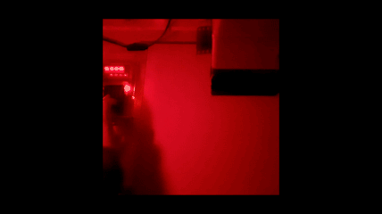

# Darkroom-timer
A programmable timer for the darkroom running on an **STM32F407** microcontroller over a custom circuit board

A report with the detailed description of the hardware and software components and a video demonstration are available in this repository
* [Report](Relazione.pdf)
* [Demo](Demo.mov)